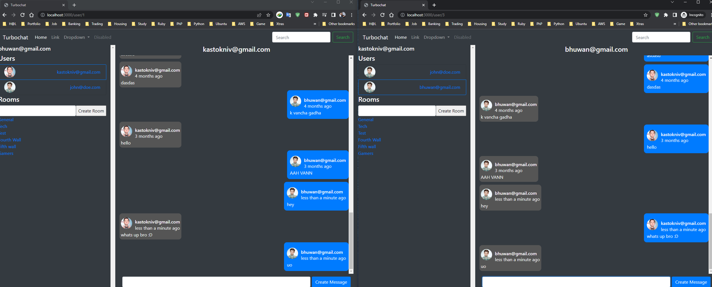

# Chat System build on Ruby on Rails

## Description

This is a chat system build using Ruby on rails. I've assembled this projects with best-practices, tweaks, documentation, and personal preferences, while still generally adhering to the "Rails way".

In this application you can:

- You can Sign-Up/Sign-in/Sign-out as a user.
- Real-time chatting with a user or on a channel.
- Create Channels to chat.
- Date and time the message was sent

## Tech Stack && Installation

- [RVM](https://rvm.io/)
- [Ruby 3.0.x/Rails 7.0.x](https://www.ruby-lang.org/en/documentation/installation/)
- [PostgreSQL](https://www.postgresql.org/download/)
- [Devise](https://github.com/heartcombo/devise/)
- [Rspec](https://github.com/rspec/rspec-rails/)
- [Tailwind CSS](https://tailwindcss.com/docs/guides/ruby-on-rails/)
- [Tailwind UI](https://tailwindui.com/)
- [Hotwire](https://hotwired.dev/)
- [Turbo](https://turbo.hotwired.dev/)
- [StimulusJS](https://stimulus.hotwired.dev/)
- [Faker](https://github.com/faker-js/faker/)
- [axios](https://github.com/axios/axios/)
- [Factory Bot Rails](https://github.com/thoughtbot/factory_bot_rails/)
- [Sweetalert2](https://sweetalert2.github.io/)
- [Heroicons](https://heroicons.com/)
- [Bundler 2.0.x](https://bundler.io/)

## Usage

Sign up as a user and login to chat with a user or on a channel.

To clone this Rails application enter the following command:

```
git clone https://github.com/kastokniv/turbochat.git
```

## After cloning

Enter the following command in the terminal and run the app.

```
bundle exec rails db:create
```

```
bundle exec rails db:migrate db:test:prepare
```

If there is any problem try

```
bundle exec rails db:reset
```

## Result

You can check the Reservation site on your localhost
`localhost:3000`


